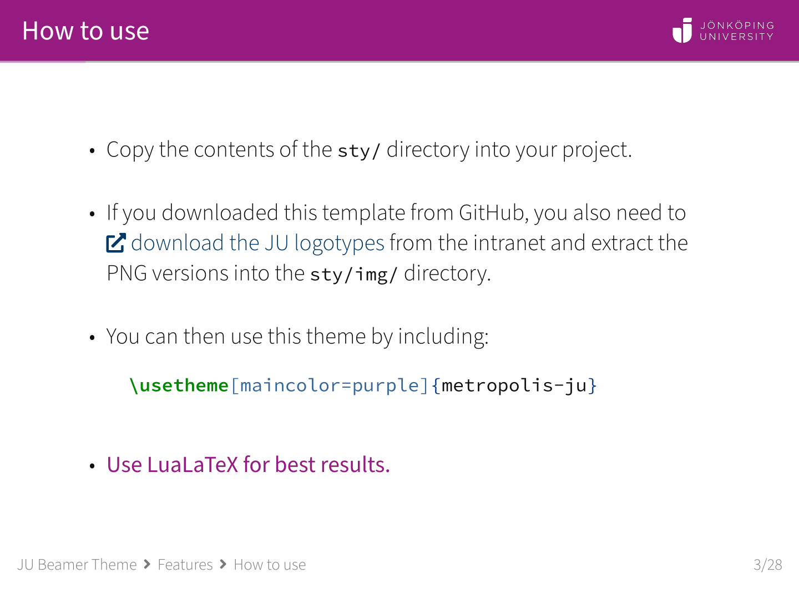
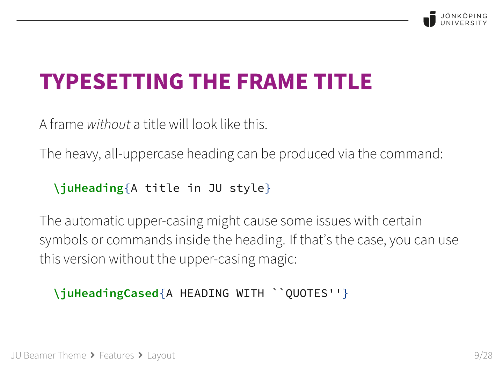
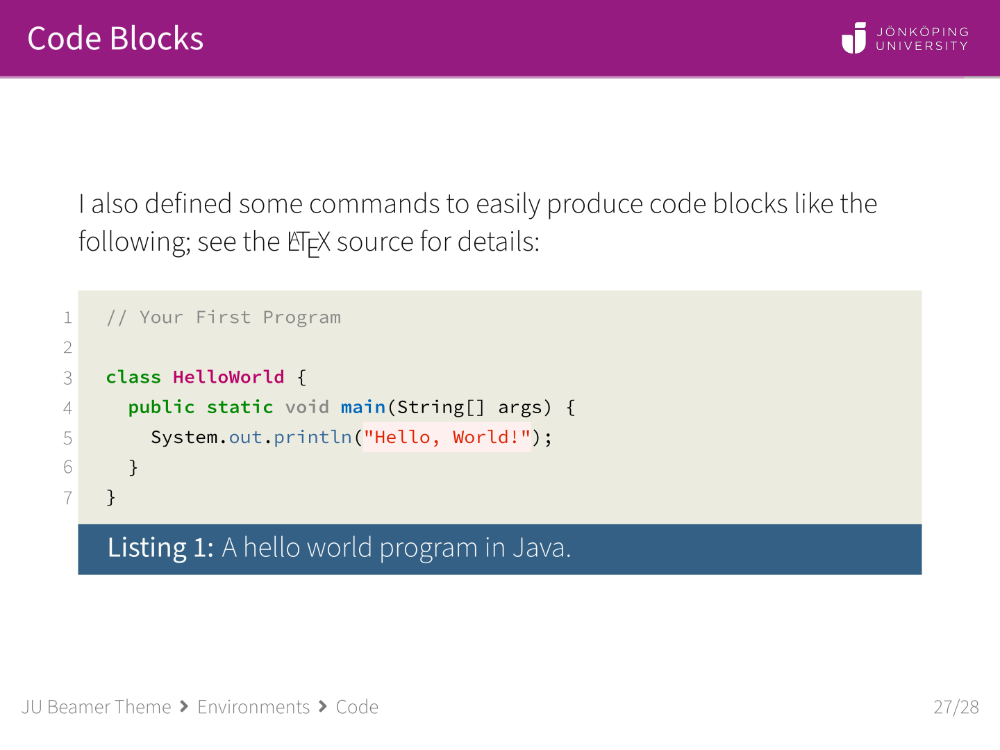

# Jönköping University Beamer Theme

A [LaTeX Beamer](https://www.overleaf.com/learn/latex/Beamer) theme with elements from [Jönköping University](https://ju.se/) branding.

## About this theme

This Beamer theme is based on the popular [Metropolis theme](https://github.com/matze/mtheme), with some customizations and additions made by myself or derived from other themes, e.g. [colorful-dream](https://github.com/EagleoutIce/beamer-themes).
All the usual customizations provided by the Metropolis theme should work; if you're not familiar with it, check out the [documentation of Metropolis](https://ftpmirror1.infania.net/mirror/CTAN/macros/latex/contrib/beamer-contrib/themes/metropolis/doc/metropolistheme.pdf) for detailed information.

:warning: This theme is **_not_ officially endorsed** by Jönköping University.  It does **not fully adhere** to JU's graphic manual.  Use at your own discretion!

## Quickstart

:notebook: If you [write to me](mailto:marcel.bollmann@ju.se) from a `@ju.se` e-mail address, I can share a link to an **Overleaf template** with everything included.

1. Copy the `latexmkrc` as well as the `sty/` directory into your project.

2. Download the desired [**logotypes** from the JU intranet](https://intranet.hj.se/intranet/en/service-and-support/marketing-and-communication/graphic-profile/logotypes.html) *(requires a JU account)* and extract the **PNG** files into `sty/img/`.

3. Select the theme in your Beamer presentation via `\usetheme{metropolis-ju}`.

4. **Compile with LuaLaTeX** (or XeLaTeX) for proper font support etc.!

### Options \& Features

The [**example presentation in this repo**](./example.pdf) explains all options, new commands, and new features.

If you want to compile this locally, make sure to check out the section about **font themes** to find out which fonts you need to have installed.

## Examples

